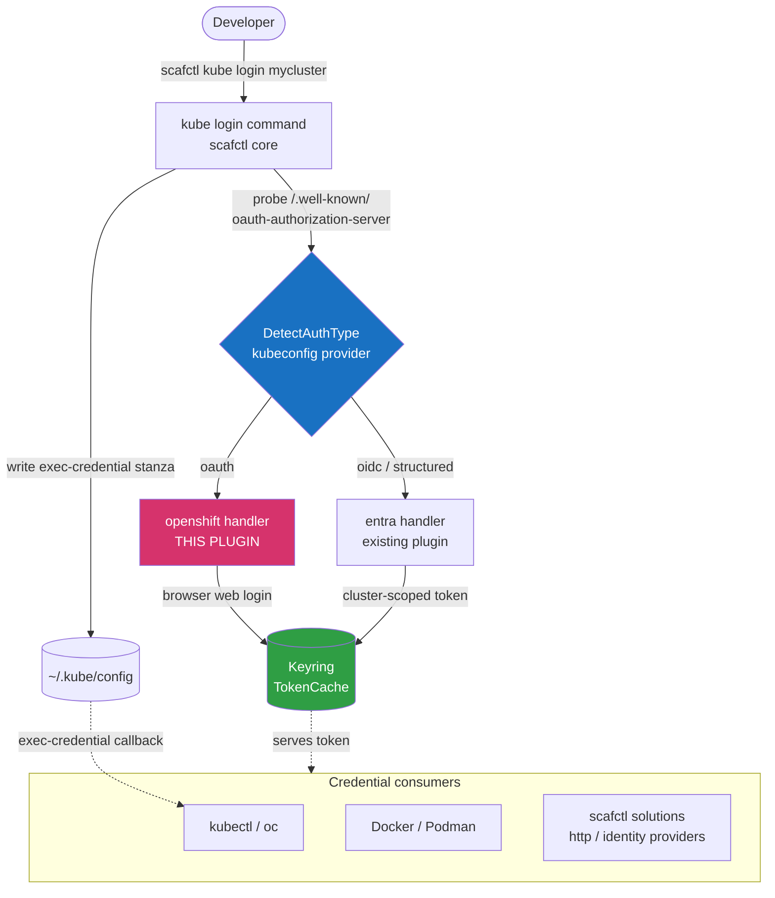
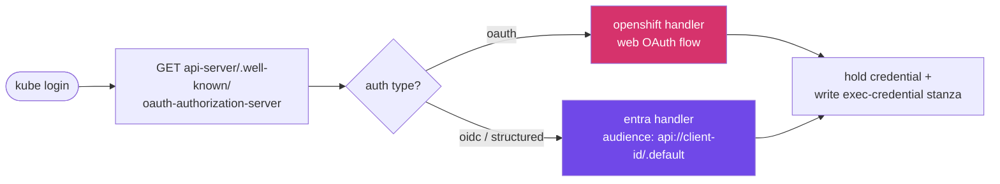
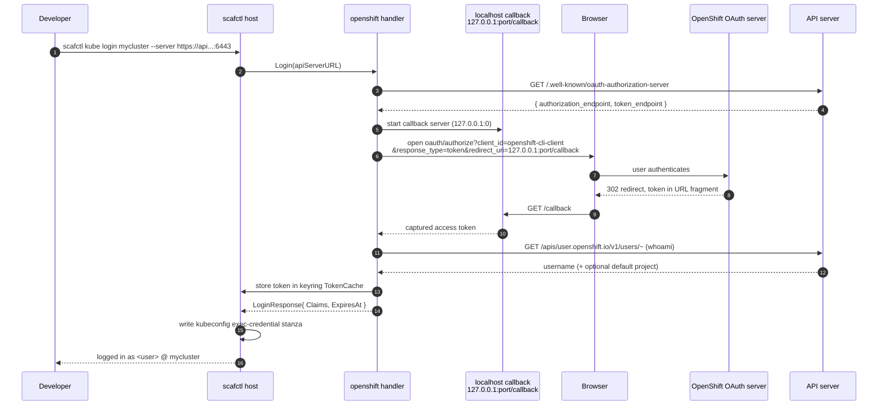
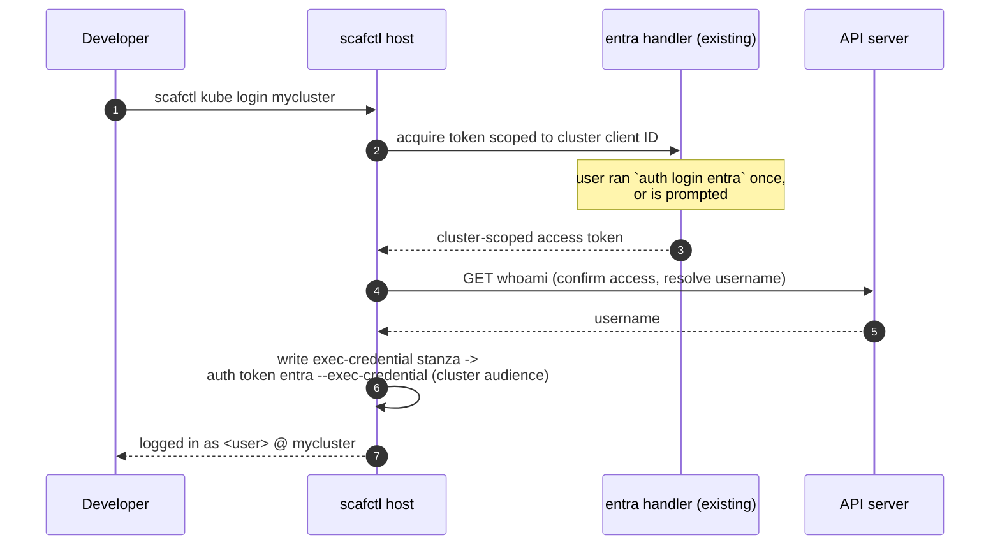
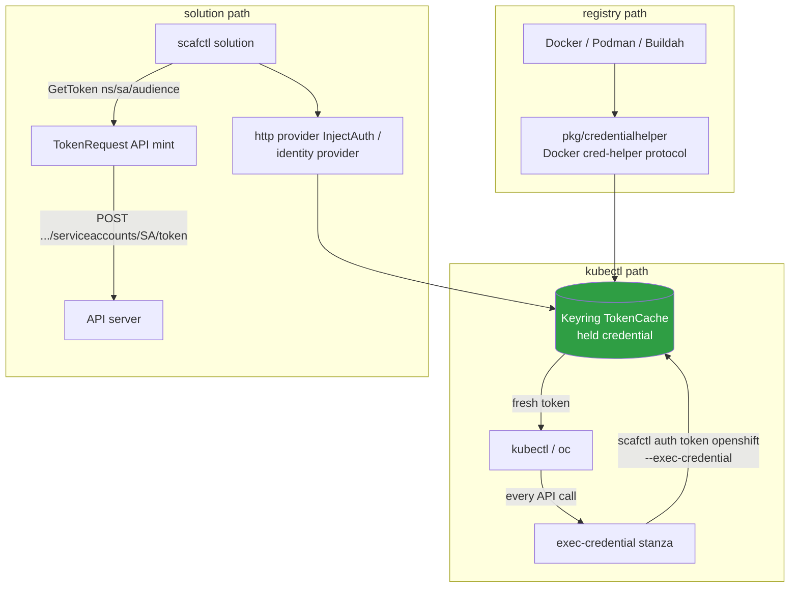
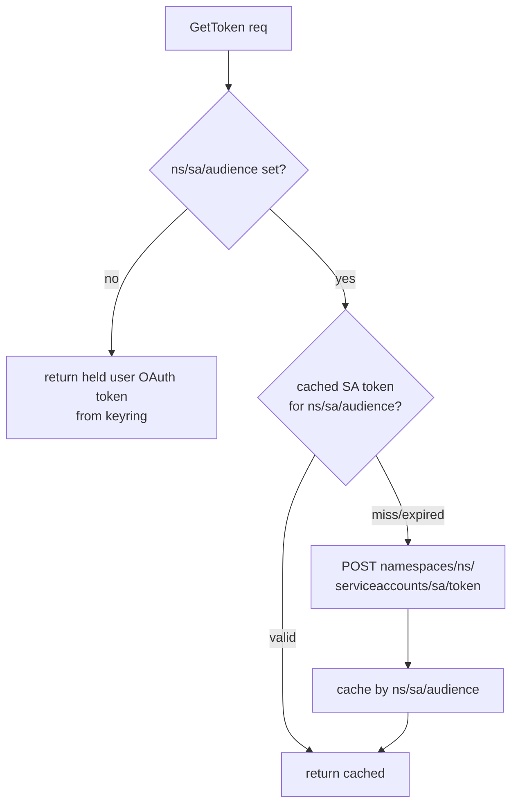
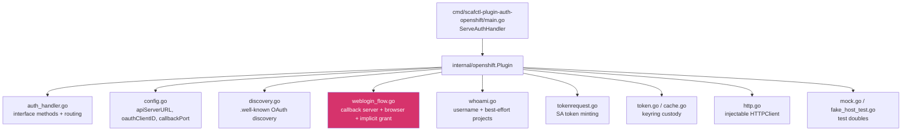

# OpenShift Auth Handler -- Design

Status: Draft
Tracking issue: [oakwood-commons/scafctl#565](https://github.com/oakwood-commons/scafctl/issues/565)
Supersedes: #212 (OpenShift browser OAuth handler), #211 (Kubernetes TokenRequest handler)
Roadmap: Phase 4 of [#536](https://github.com/oakwood-commons/scafctl/issues/536)

## Goal

Let a developer log into an OpenShift cluster **once** and have scafctl hold that
credential centrally, then serve it back to whatever needs it -- inside solutions
and as a credential helper for other tools (`kubectl`/`oc`, Docker/Podman).

The cluster decides how you authenticate; scafctl auto-detects and routes:

1. **Web login (OpenShift OAuth)** -- the cluster runs OpenShift's built-in OAuth
   server. scafctl opens a browser (the `oc login --web` experience), captures
   the token, and holds it. _This is the new piece this plugin adds._
2. **Entra (structured authentication / OIDC)** -- the cluster delegates to Azure
   AD / Entra. scafctl reuses the existing `entra` handler to mint a
   cluster-scoped token. No new browser flow.

The user runs the **same command** either way.

## Scope split

The end-to-end feature spans two repositories. This document is the design for
the plugin; the routing/registration/docs items require changes in scafctl core.

| Area | Repo | This doc |
|---|---|---|
| `openshift` web-login handler (OAuth) | `scafctl-plugin-auth-openshift` (here) | yes |
| OAuth discovery, whoami, TokenRequest minting | here | yes |
| Token custody + status/logout | here | yes |
| Two-path routing in `kube login` (`DetectAuthType`) | `oakwood-commons/scafctl` core | no, out of repo |
| `pkg/credentialhelper` registry inference | core | no |
| Register in `pkg/auth/official/official.go` | core | no |
| Design docs `docs/design/kubernetes-auth.md` | core | no |

## Why this is mostly already built

Phases 1-3 shipped the supporting machinery; Phase 4 adds the OpenShift OAuth
web-login handler plus the two-path routing.

| Capability | Where | Status |
|---|---|---|
| Entra / Azure AD token flow | `entra` auth handler plugin | shipped |
| `kube login` / `kube logout` | `pkg/cmd/scafctl/kube` (#562) | shipped |
| Auth-type detection (oauth / oidc / auto) | `kubeconfig` provider `DetectAuthType` | shipped (plugin v0.1.1) |
| Kubeconfig exec-credential stanza | `pkg/auth/execcredential` | shipped |
| Keyring token cache | auth `TokenCache` | shipped |
| **OpenShift OAuth browser web-login** | **new `openshift` handler** | **this issue** |

---

## Architecture overview



Both paths end identically: scafctl holds the credential in the keyring and
writes a kubeconfig exec-credential stanza that calls scafctl back for a fresh
token on every API request. **scafctl is the credential helper.**

---

## Auto-detection (the fork)

On `kube login <cluster>`, scafctl core probes the API server's
`/.well-known/oauth-authorization-server`. `DetectAuthType` (already in the
`kubeconfig` provider) returns `oauth` / `oidc` / `auto`.



- `oauth` -> the new `openshift` handler (web OAuth flow).
- `oidc` / structured -> existing `entra` handler with the cluster's audience.
  No new code in this handler -- just routing plus an audience.

---

## Pillar 1 -- Web login (new `openshift` handler)

The genuinely OpenShift-specific piece. Modeled on the localhost-callback flow
in the `entra` plugin's `authcode_flow.go`, but using OpenShift's public CLI
client and the implicit grant (`response_type=token`).



Steps:

1. Discover the OAuth endpoint from `GET <api-server>/.well-known/oauth-authorization-server`
   (the authorization endpoint is usually on a different host than the API server).
2. Start a localhost callback server (`127.0.0.1:0`, `/callback`).
3. Open the browser to the authorize URL using `openshift-cli-client` (the
   public CLI client, implicit grant -- token returned in the URL fragment). The
   client ID is a configurable default.
4. Capture the token, call `whoami` for the username, optionally resolve the
   default project/namespace (best-effort).
5. Store the token in the keyring `TokenCache`; the host writes the kubeconfig
   exec-credential stanza.

> Note: the token arrives in the URL **fragment** (`#access_token=...`), which a
> server never receives directly. The callback page serves a tiny HTML/JS
> snippet that re-posts the fragment to the callback server as a query param.

---

## Pillar 2 -- Entra login (reuse existing handler)

For structured-auth clusters, no OpenShift browser flow.



No new code in this plugin -- routing plus an audience only.

---

## Pillar 3 -- Use the held credential



- **Solutions** -- the `identity` provider and HTTP `InjectAuth` authenticate
  cluster API calls using the held credential. For service-account tokens (e.g.
  downstream OIDC consumers), `GetToken` mints via the Kubernetes TokenRequest
  API (`POST /api/v1/namespaces/{ns}/serviceaccounts/{sa}/token`) -- no `oc`.
- **kubectl / oc** -- the exec-credential stanza fetches a fresh token per call.
- **Docker / Podman / Buildah** -- scafctl's existing `pkg/credentialhelper`
  serves credentials for the OpenShift integrated image registry once
  `openshift` is registered for registry-to-handler inference (core change).

### GetToken: two modes



---

## Component layout (this plugin)



---

## Key technical decisions

1. **Flow & capabilities** -- advertise `auth.FlowInteractive` (browser) +
   `CapCallbackPort`, not `FlowDeviceCode`. The SDK has no "oauth" flow constant;
   interactive is the right match for a localhost-callback browser flow.

2. **Avoid `client-go`** note: -- plugin binaries >32 MiB fail to fetch (oras-go
   32 MiB blob cap), which is exactly what broke the `kubeconfig` plugin.
   Implement OAuth discovery, whoami, and the TokenRequest call as **raw HTTP**
   against the API server. Keeps the binary small and avoids the known fetch
   failure.

3. **Token custody** -- store in the host secret store
   (`HostClientFromContext(ctx).SetSecret/GetSecret/DeleteSecret`), keyed by
   cluster, mirroring entra's `cache.go`.

4. **Generic, no hardcoded org values** -- `apiServerURL`, OAuth client ID, and
   audiences come from config / `LoginRequest`, with `openshift-cli-client` as
   the default client ID. whoami / project listing are best-effort (graceful
   degradation, never block auth).

5. **`GetToken` two modes** -- return the held user token by default; when
   `TokenRequest` carries namespace/sa/audience, mint a scoped SA token via the
   TokenRequest API and cache by ns/sa/audience.

---

## Implementation sequencing

1. Config + discovery (`config.go`, `discovery.go`) with unit tests against a
   mock transport.
2. Web login flow (`weblogin_flow.go`) -- callback server, browser open,
   fragment-token capture; wire into `Login`. Update `GetAuthHandlers`
   flows/capabilities.
3. Token custody (`token.go`, `cache.go`) + `GetStatus`/`Logout` reading/clearing
   the secret store.
4. whoami enrichment (best-effort claims).
5. `GetToken` TokenRequest minting.
6. Rewrite `auth_handler_test.go` + add `fake_host_test.go` / `mock.go`; hit the
   repo coverage bar (70%+).
7. `task ci` (lint + test + build), then release/publish to
   `ghcr.io/oakwood-commons/auth-handlers/openshift`.
8. Separate **core** PRs: routing (`DetectAuthType` fork), credential-helper
   registry inference, `official.go` registration + test, core docs.

### `defaultAuthHandlers` entry (core change, for reference)

```go
{
    Name:           "openshift",
    CatalogRef:     "openshift",
    DefaultVersion: "latest",
    MinSDKVersion:  "0.2.0",
    // OAuth host is config-driven (per-cluster), so domain validation
    // is handled per-cluster rather than hardcoded.
},
```

---

## CLI sketch

```bash
# One command regardless of auth type; scafctl auto-detects and holds the credential
scafctl kube login mycluster --server https://api.mycluster.example.com:6443
#   oauth cluster      -> browser web login (openshift handler)
#   structured/oidc    -> entra handler, cluster-scoped token

kubectl get pods            # kubectl calls scafctl for a fresh token

# Mint an SA token inside a solution / for downstream OIDC
scafctl auth token openshift --namespace infra-auto --sa pipeline --audience openshift

# Docker/Podman pull from the OpenShift integrated registry via the cred helper
podman pull default-route-openshift-image-registry.mycluster/myns/myimage

scafctl kube logout mycluster   # clears keyring + managed kubeconfig entries
```

---

## Open questions

1. Should `GetToken`'s default return the **user OAuth token** or always mint an
   SA token?
2. Is the Entra-path audience defaulting handled here or entirely in core
   routing?

## References

- Parent proposal: [#536](https://github.com/oakwood-commons/scafctl/issues/536) (Kubernetes/OpenShift auth umbrella -- not superseded)
- Supersedes: [#212](https://github.com/oakwood-commons/scafctl/issues/212), [#211](https://github.com/oakwood-commons/scafctl/issues/211)
- Precedent: `scafctl-plugin-auth-entra` (handler layout + localhost-callback OAuth),
  `scafctl-plugin-kubeconfig` v0.1.1 (`DetectAuthType`, TokenRequest),
  `pkg/credentialhelper` (Docker credential-helper protocol),
  `pkg/auth/execcredential` (kubectl exec-credential)
