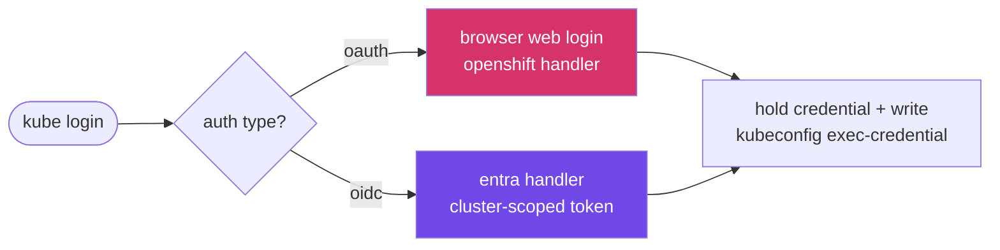

# Tutorial: Log into OpenShift once, use the credential everywhere

> **Status: forward-looking.** This walkthrough describes the target experience
> for the `openshift` auth handler ([#565](https://github.com/oakwood-commons/scafctl/issues/565)).
> It doubles as the acceptance criteria for the implementation -- when every
> snippet below works as written, the handler is feature-complete. See
> [openshift-auth.md](../design/openshift-auth.md) for the design.

## What you'll learn

1. Log into an OpenShift cluster with a single command (no `oc` required).
2. Let `kubectl`/`oc` use the held credential automatically.
3. Use the credential inside a scafctl solution.
4. Mint a service-account token for a downstream consumer.
5. Pull from the integrated image registry with Podman/Docker.
6. Log out and clear everything.

## Prerequisites

- scafctl installed (`scafctl version`).
- Network access to your cluster's API server.
- The `openshift` handler available (installed from the catalog or built locally).

```bash
# From the catalog
scafctl install plugin auth-openshift

# Or build + install locally from this repo
task release:local VERSION=0.1.0
```

---

## Step 1 -- Log in (one command, either auth type)

```bash
scafctl kube login mycluster --server https://api.mycluster.example.com:6443
```

scafctl probes `/.well-known/oauth-authorization-server` and routes
automatically:



- **OAuth cluster** -> a browser opens; sign in and the tab closes itself. The
  token is captured via a localhost callback and stored in your keyring.
- **OIDC / Entra cluster** -> no OpenShift browser flow; scafctl reuses your
  `entra` login to mint a cluster-scoped token.

Expected output:

```text
Detected auth type: oauth
Opening browser to authenticate...
Logged in as jane.doe@example.com @ mycluster
Wrote exec-credential to ~/.kube/config (context: mycluster)
```

> Headless box / SSH session? The browser can't open. Use the printed URL on
> another machine, or fall back to the Entra path if the cluster supports it.

---

## Step 2 -- Use kubectl / oc (zero extra setup)

The login wrote an exec-credential stanza, so the cluster credential refreshes
on demand:

```bash
kubectl get pods
oc get projects
```

Under the hood, each API call invokes
`scafctl auth token openshift --exec-credential`, which returns a fresh token
from the keyring. No `oc login`, no stale token files.

---

## Step 3 -- Use the credential in a solution

Reference the handler with `authProvider: openshift`. The `http` provider
injects the held token:

```yaml
# examples/solution.yaml
apiVersion: scafctl.io/v1
kind: Solution
metadata:
  name: openshift-example
spec:
  resolvers:
    pods:
      resolve:
        with:
          - provider: http
            inputs:
              url: https://api.mycluster.example.com:6443/api/v1/namespaces/default/pods
              authProvider: openshift
  workflow:
    actions:
      show:
        provider: message
        inputs:
          type: data
          data:
            rslvr: pods
```

```bash
scafctl run solution -f ./examples/solution.yaml
```

---

## Step 4 -- Mint a service-account token

For downstream OIDC consumers (e.g. Workload Identity Federation), mint a
scoped SA token via the Kubernetes TokenRequest API -- still no `oc`:

```bash
scafctl auth token openshift \
  --namespace infra-auto \
  --sa pipeline \
  --audience openshift
```

Example: feed an Azure WIF exchange.

```bash
export AZURE_FEDERATED_TOKEN="$(scafctl auth token openshift --ns infra-auto --sa pipeline)"
export AZURE_CLIENT_ID="xxxxxxxx-xxxx-xxxx-xxxx-xxxxxxxxxxxx"
export AZURE_TENANT_ID="yyyyyyyy-yyyy-yyyy-yyyy-yyyyyyyyyyyy"
scafctl run resolver -f platform-assets-wif.yaml -r name=iac-team
```

---

## Step 5 -- Pull from the integrated registry

Once `openshift` is registered for registry-to-handler inference, scafctl's
Docker credential-helper serves registry creds automatically:

```bash
podman pull default-route-openshift-image-registry.mycluster/myns/myimage
```

---

## Step 6 -- Log out

```bash
scafctl kube logout mycluster
```

Clears the keyring entry and the managed kubeconfig context.

---

## Troubleshooting

| Symptom | Likely cause | Fix |
|---|---|---|
| Browser doesn't open | Headless/SSH session | Copy the printed URL to a browser, or use the Entra path |
| `not authenticated` from `auth token` | Login expired or never ran | Re-run `scafctl kube login <cluster>` |
| `whoami` fails but login succeeds | Best-effort enrichment unavailable | Non-fatal; auth still works. Check API server reachability |
| Wrong auth path chosen | Cluster well-known endpoint ambiguous | Force with the handler/flow override flags on `kube login` |
| Plugin fails to fetch (`manifest has no content layers`) | Binary >32 MiB (oras cap) | Ensure the build avoids `client-go`; keep the binary small |

## See also

- Design: [openshift-auth.md](../design/openshift-auth.md)
- Issue: [#565](https://github.com/oakwood-commons/scafctl/issues/565)
- Precedent plugin: `scafctl-plugin-auth-entra`
